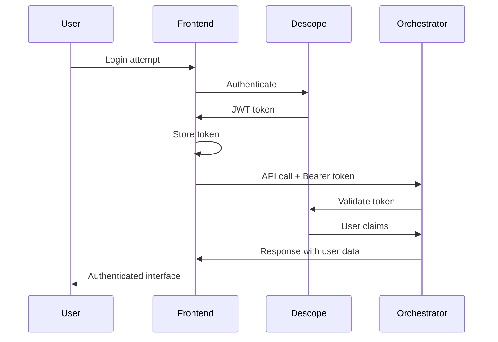
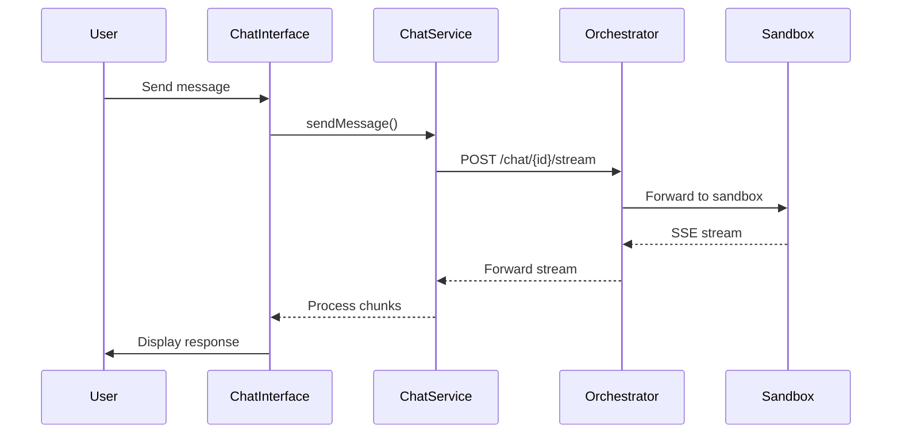
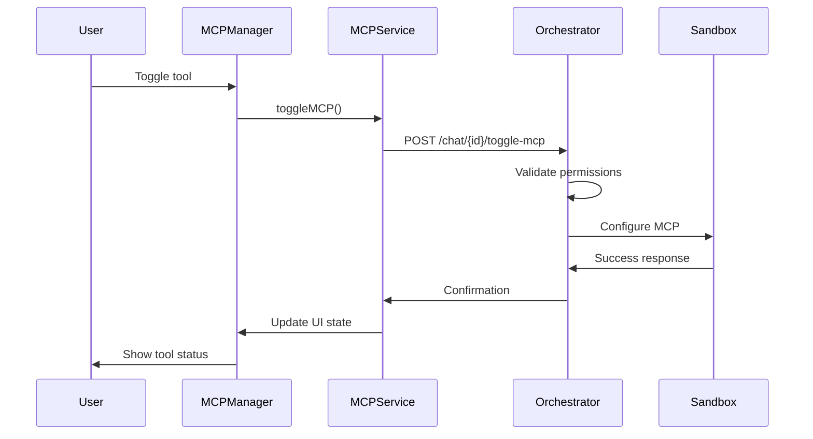

# Fleet Frontend Architecture

This document describes the architectural design and patterns used in the Fleet Frontend application.

## High-Level Architecture

The Fleet Frontend follows a modern React/Next.js architecture with clear separation of concerns:

```
┌─────────────────────────────────────────────────────┐
│                 Browser Client                       │
│                                                     │
│  ┌─────────────────┐  ┌─────────────────┐          │
│  │   React Pages   │  │  UI Components  │          │
│  │                 │  │                 │          │
│  │  - Chat         │  │  - ChatInterface│          │
│  │  - Marketplace  │  │  - MCPManager   │          │
│  │  - Auth         │  │  - Navbar       │          │
│  └─────────────────┘  └─────────────────┘          │
│           │                     │                   │
│  ┌─────────────────┐  ┌─────────────────┐          │
│  │ Custom Hooks    │  │   Services      │          │
│  │                 │  │                 │          │
│  │  - useChat      │  │  - chatService  │          │
│  │  - useSandbox   │  │  - mcpService   │          │
│  │  - useDeviceId  │  │  - authService  │          │
│  └─────────────────┘  └─────────────────┘          │
└─────────────────────────────────────────────────────┘
           │                     │
           ▼                     ▼
┌─────────────────┐    ┌─────────────────┐
│ Sandbox         │    │ Descope         │
│ Orchestrator    │    │ Auth Service    │
│                 │    │                 │
│ - Session Mgmt  │    │ - JWT Tokens    │
│ - MCP Config    │    │ - User Roles    │
│ - Sandbox API   │    │ - OAuth         │
└─────────────────┘    └─────────────────┘
           │
           ▼
┌─────────────────┐
│ E2B Sandbox     │
│ (FastAPI Bot)   │
│                 │
│ - Chat Stream   │
│ - Tool Exec     │
│ - MCP Tools     │
└─────────────────┘
```

## Layer Architecture

### 1. Presentation Layer

#### Pages (`/app`)
Next.js App Router pages that define the application's routing structure:

- **Root Layout** (`layout.js`): Provides global providers and styling
- **Home Page** (`page.js`): Authentication gate and redirect logic
- **Chat Page** (`chat/page.js`): Main chat interface container
- **Marketplace** (`marketplace/page.js`): MCP tool discovery and installation
- **Auth Callback** (`auth/inbound/callback/page.js`): OAuth redirect handling

#### Components (`/components`)
Reusable UI components organized by feature:

**Core Components:**
- `ChatInterface.js` - Main chat orchestration component
- `MCPManager.js` - Tool management and configuration
- `Auth.js` - Authentication flows and state
- `Navbar.js` - Navigation and user menu

**UI Components** (`/components/ui`):
- shadcn/ui based design system components
- Consistent styling and interaction patterns
- Accessible and responsive design

**Chat Components** (`/components/chat`):
- `ChatMessages.jsx` - Message rendering and streaming
- `ChatInput.jsx` - Message composition and sending
- `ChatHeader.jsx` - Session info and controls
- `SandboxStatus.jsx` - Sandbox connection monitoring

### 2. Business Logic Layer

#### Custom Hooks (`/hooks`)
Encapsulate stateful logic and side effects:

**`useChat`**
- Message state management
- Streaming response handling
- Send message coordination
- Error handling and retry logic

**`useSandbox`**
- Sandbox lifecycle monitoring
- Connection status tracking
- Polling for readiness
- Error recovery mechanisms

**`useDeviceId`**
- Device identification for session tracking
- Persistent storage across sessions
- Privacy-conscious implementation

#### Services (`/services`)
API communication and external service integration:

**`chatService.js`**
- Chat session management
- Message history persistence
- Real-time streaming coordination
- Error handling and retries

**`mcpService.js`**
- Tool discovery and configuration
- Environment variable management
- OAuth token handling
- Marketplace integration

### 3. Data Flow Patterns

#### Authentication Flow


#### Chat Message Flow


#### MCP Tool Management Flow


## State Management

### Local State Strategy
The application uses React's built-in state management with custom hooks for coordination:

**Component State:**
- UI-specific state (modals, forms, loading states)
- Ephemeral data that doesn't need persistence

**Hook State:**
- Cross-component shared state
- Complex state logic with reducers
- Side effect coordination

**Service State:**
- API response caching
- Connection status tracking
- Error state management

### State Persistence
- **Session Storage**: Device ID, temporary preferences
- **No Client Persistence**: Security-first approach for auth tokens
- **Server Persistence**: Chat history, MCP configurations via backend APIs

## Component Communication Patterns

### Parent-Child Communication
- Props for downward data flow
- Callback functions for upward event flow
- Context for deeply nested components

### Sibling Communication
- Custom hooks for shared state
- Event system via parent components
- Service layer for data coordination

### Cross-Feature Communication
- Service layer APIs
- Custom hook composition
- Context providers for global state

## Error Handling Architecture

### Error Boundaries
- Global error boundary for unhandled exceptions
- Feature-specific error boundaries for graceful degradation
- Fallback UI components for error states

### API Error Handling
- Consistent error response format from backend
- Service layer error transformation
- User-friendly error messages
- Automatic retry logic for transient failures

### Stream Error Handling
- Connection failure recovery
- Partial message handling
- Timeout management
- Reconnection strategies

## Performance Optimization

### Code Splitting
- Route-based code splitting via Next.js
- Component lazy loading for large features
- Dynamic imports for optional features

### Rendering Optimization
- React.memo for expensive components
- useMemo/useCallback for expensive computations
- Virtualization for large lists (if needed)

### Network Optimization
- Request deduplication
- Response caching where appropriate
- Connection pooling for SSE streams
- Optimistic updates for better UX

## Security Architecture

### Authentication Security
- JWT tokens with automatic refresh
- Secure token storage (memory-only)
- CSRF protection via SameSite cookies
- Session timeout handling

### Input Validation
- Client-side validation for UX
- Server-side validation for security
- XSS prevention via React's built-in protection
- Content Security Policy headers

### API Security
- Authentication headers on all requests
- Request/response encryption via HTTPS
- Rate limiting handled by backend
- Error message sanitization

## Testing Strategy

### Unit Testing
- Component testing with React Testing Library
- Hook testing with @testing-library/react-hooks
- Service layer testing with mock APIs

### Integration Testing
- End-to-end user flows
- API integration testing
- Authentication flow testing

### Performance Testing
- Bundle size monitoring
- Runtime performance profiling
- Memory leak detection

## Deployment Architecture

### Build Process
- Next.js optimization and bundling
- Environment-specific configuration
- Static asset optimization
- Progressive Web App features

### Hosting Strategy
- Static site hosting (Vercel, Netlify)
- CDN for global distribution
- Environment variable injection
- Health check endpoints

### Monitoring
- Error tracking with Sentry (if configured)
- Performance monitoring
- User analytics (privacy-conscious)
- API response time monitoring

This architecture provides a scalable, maintainable foundation that supports the complex requirements of real-time AI chat with dynamic tool integration while maintaining security and performance standards.